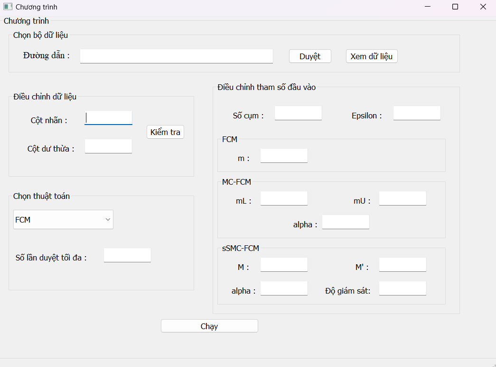
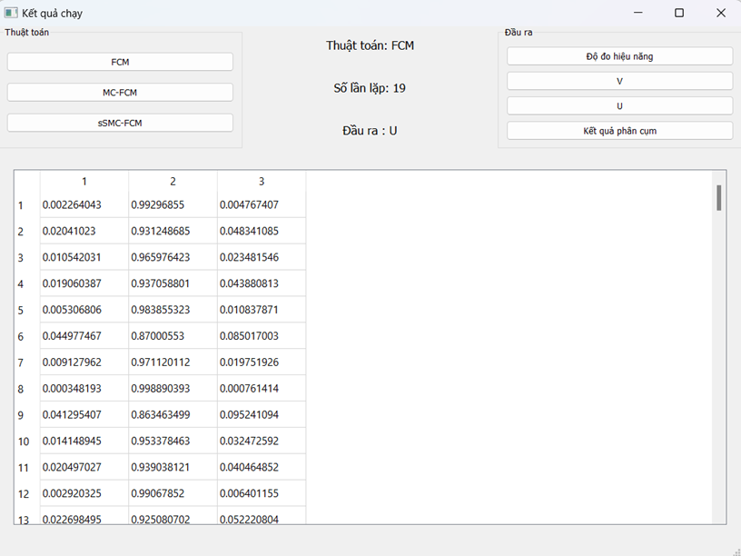

Giới thiệu
----
Về sự ảnh hưởng của tham số mờ hóa trong thuật toán phân cụm mờ

Cài đặt các thuật toán phân cụm mờ, phân cụm mờ bán giám sát được trình bày trong bài báo

Chạy chương trình
---

Command
---

```
pip install -r requirement.txt

SET PYTHONPATH=path-to-project

python src/app.py
```
Giao diện 
--- 


Kết quả
---



Reference
---
- Tran Dinh Khang, Nguyen Duc Vuong, Manh-Kien Tran, Michael Fowler, Fuzzy C‐Means Clustering Algorithm with Multiple Fuzzification Coefficients, Algorithms 2020, 13, 158
- Tran Dinh Khang, Manh-Kien Tran, Michael Fowler, A Novel Semi-Supervised Fuzzy C-Means Clustering Algorithm Using Multiple Fuzzification Coefficients, Algorithms 2021, 14, 258.
- Trần Đình Khang, Đỗ Lê Quang, Võ Đức Quang, Về sự ảnh hưởng của các tham số mờ hóa trong thuật toán phân cụm mờ, Kỷ yếu Hội nghị Quốc gia lần thứ XV về Nghiên cứu cơ bản và ứng dụng Công Nghệ thông tin (FAIR); Hà Nội, ngày 3-4/11/2022